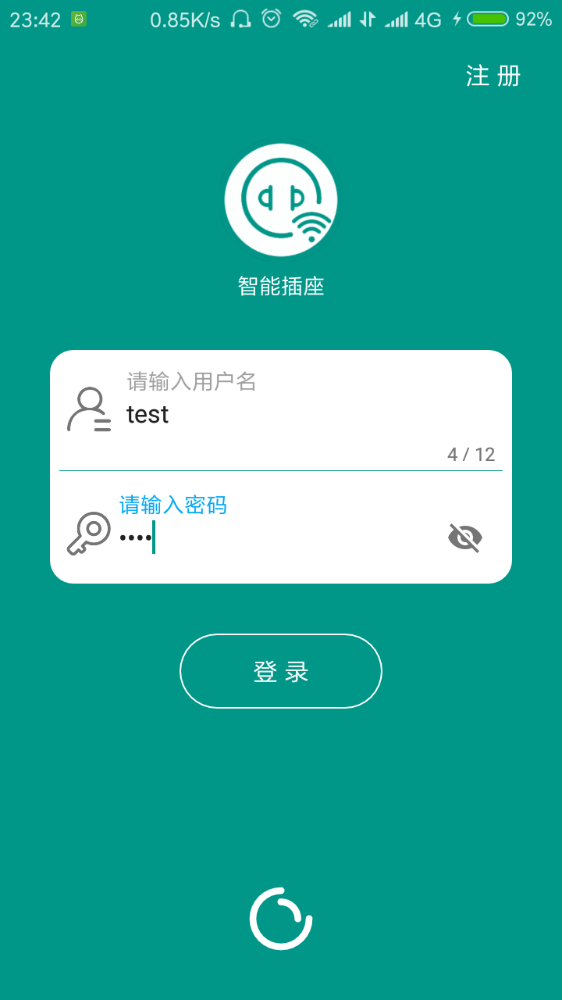
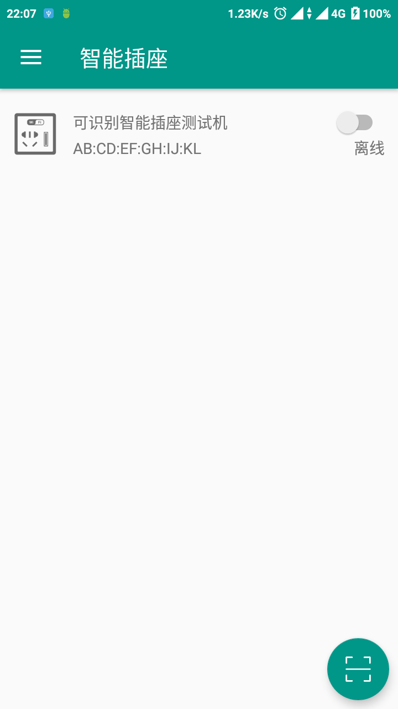
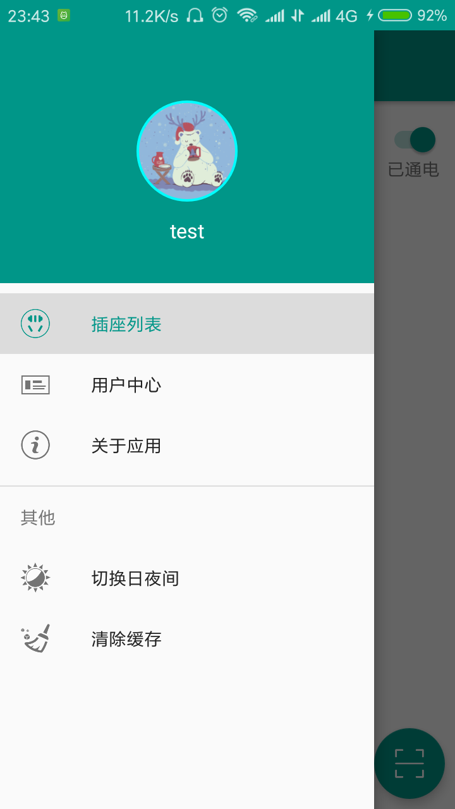
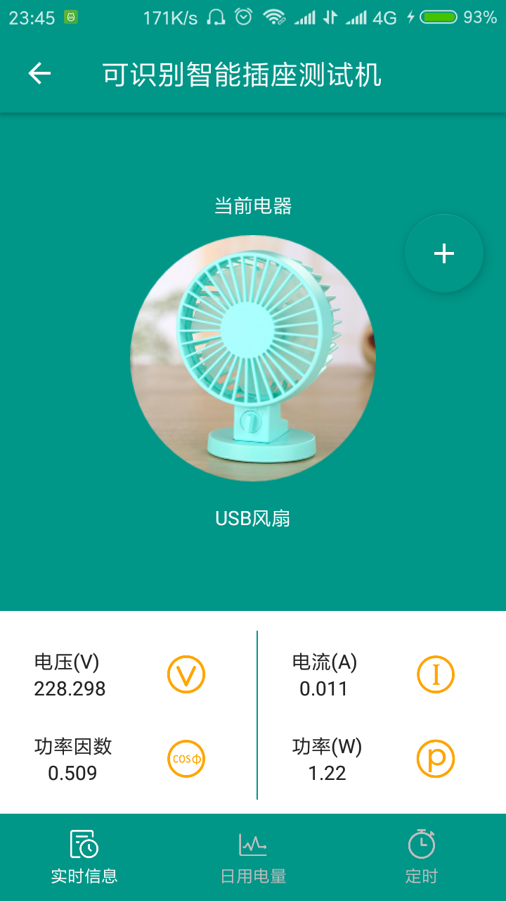
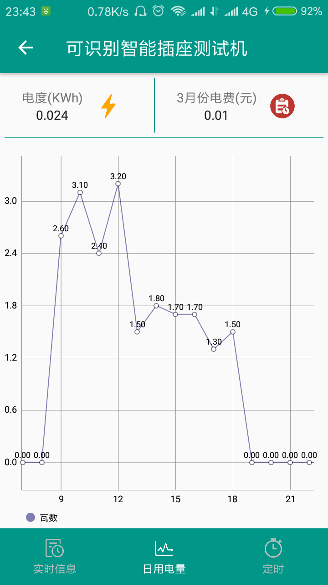
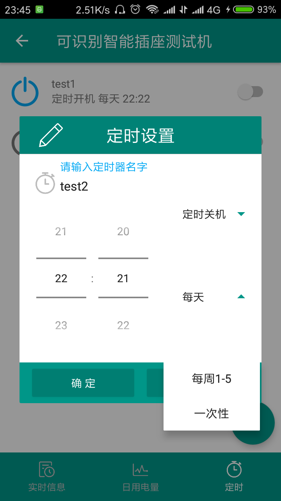
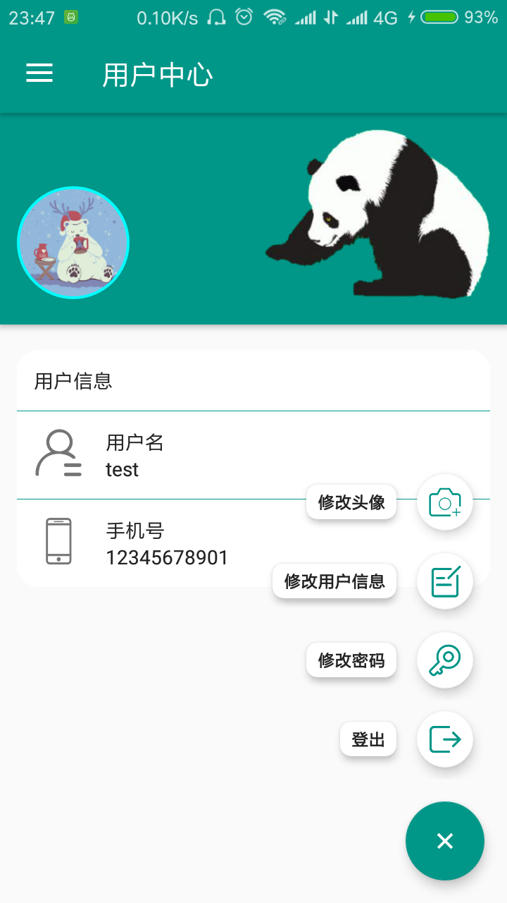
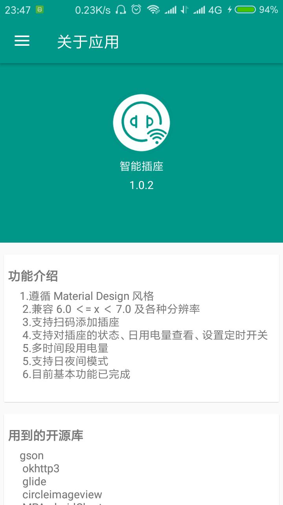

# 智能插座

基于 Material Design 和 MVP 开发模式的智能插座客户端

支持：Android 4.4 及以上

目前 APP 出于快速更迭状态，可能界面略显粗糙

以下是部分截图：

# 命名规范

由于经常出现命名犯难问题，所以写下一些自己总结的规范

## 布局 Layout：

prefix_where

 prefix   |             usage
:-------: | :---------------------------:
activity_ |         activity 内容视图
fragment_ |         fragment 内容视图
  item_   | 在list/recycler/gridview/等使用的项
 layout_  |      在include标签引用的可复用布局
  view_   |           自定义的扩展视图

示例：

- activity_main
- fragment_user_detail
- item_article
- layout_actionbar_backbutton
- view_menu

## 字符串 String：

where_description

复用：all_description

示例：

- article_detail_title
- feedback_explanation
- feedback_namehint
- all_done

## Drawable：

where_description_size

复用：all_description_size

示例：

- article_detail_placeholder
- all_info_icon
- all_info_icon_large
- all_info_icon_32dp

## ID：

what_where_description

开头大写主要是因为控件的命名就是这样

示例：

- TabLayout_main
- ImageView_menu_profile
- TextView_article_detail_title
